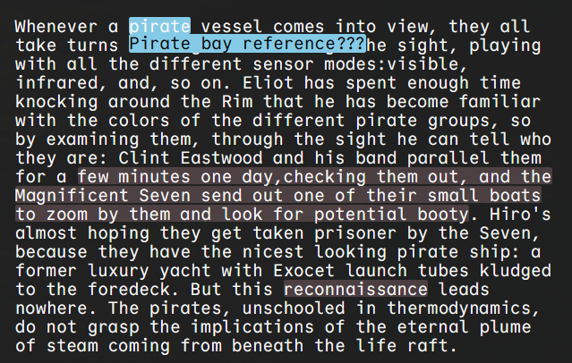

# HighlightJS - A Text Highlighting Module

The goal was to provide a way to quickly annotate/highlight text. This is my first time creating something with the intention for other developers to use it, the dev ux might be a bit mediocre. Code critiques and contributions are encouraged.

### Demo
A live demo is hosted [here](https://tadgh.dev/highlightjs/)

### Possible Bugs

- Highlights are added at the top of the DOM, text with a z-index contained in a parent with a lower z-index may cause issues
- Some CSS needs to be moved inside the `highlighterjs` class still. Methods should be created to edit these values
- The default baked in form submission goes no where, is this in scope. I don't think so but felt this should be mentioned

### Preview



## Examples

You can view a few examples inside `app.js`

### Default

You query your DB for the stored comments/highlights and add them createTextHighlight()

```js
const highlighter1 = new TextHighlighter("highlightedDiv1")
	.setFormTransparency(true)
	.initialize();

highlighter1.createTextHighlight(
	747,
	760,
	"Woah this is going somewhere woo hoo",
	2
);
highlighter1.setCalibratorWidthSensitivity(2);
```

### Custom Implementation

Perhaps my styling/form is 'ugly' you can create you own and pass the ID through

```js
// see full implementation in app.js customHighlight()
const highlighter2 = new TextHighlighter("highlightedDiv2", "outputHover2")
	.setFormId("customForm")
	.setMouseUpFunction(textFunction)
	.setHighlightColors(customHighlightColors)
	.initialize();

highlighter2.setCalibratorWidthSensitivity(2);
highlighter2.createTextHighlight(
	747,
	760,
	"Woah this is going somewhere woo hoo",
	2
);
```

### Dynamic/Moving Content

Maybe the highlights are flying around the screen?

```js
// see full implementation in app.js movingHighlight()
const radius = 20; // Size of the circle
const speed = 0.05; // Speed of rotation
let angle = 0;

const highlighter3 = new TextHighlighter(
	"highlightedDivMoving",
	"outputHover3"
).initialize();

highlighter3.createTextHighlight(
	747,
	760,
	"Woah this is going somewhere woo hoo",
	2
);
const movingDiv = document.getElementById("highlightedDivMoving");

function animate() {
	// Calculate x and y position using trigonometry
	const xOffset = Math.cos(angle) * radius;
	const yOffset = Math.sin(angle) * radius;

	// Apply the transform
	movingDiv.style.transform = `translate(${xOffset}px, ${yOffset}px)`;

	// Increment the angle
	angle += speed;

	// Request the next frame
	requestAnimationFrame(animate);

	// Force reposition items
	highlighter3.repositionItems();
}

// Start the animation
animate();
```
